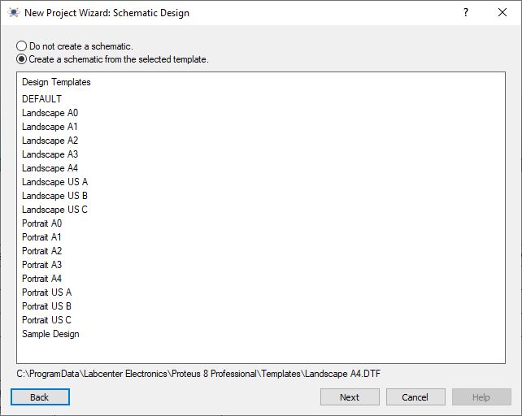
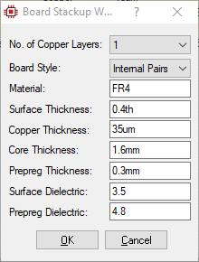
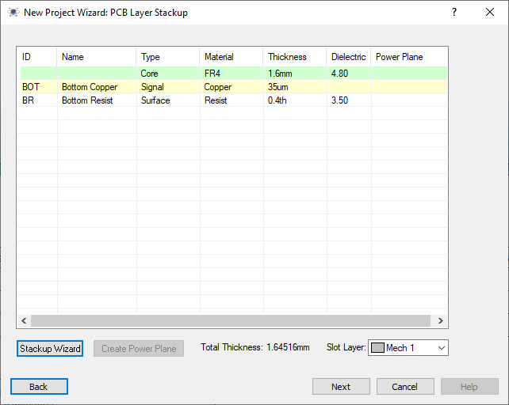
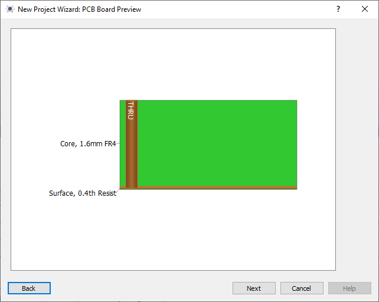

# [DRAFT] Expansion Board Fabrication (Part I: Schematic Capture)

## Objectives
Learn by practice the development process of a medium-sized, single layer, through-hole mounted printed circuit board using state-of-the-art software Proteus 8.11.

## Introduction 
In this lab series of two, we will design the Printed Circuit Board (PCB) of an expansion card to use along with the Curiosity board to expand its hardware interface and make easier to interact with the PIC18F45K50 &mu;C. This process is divided in two parts: part I comprises the circuit schematic, and part II corresponds to the PCB layout and GERBER files generation. Board fabrication will be carried out using laser etching machinery in campus by trained personnel, as well as card drilling; component mounting is responsability of the student, (soldering iron and tin/lead wire are required).

The expansion board includes the components listed in the table below. (links to datasheets of relevant components available):

Component | Quantity | Device ID
:---   | :---: | :---
[16×2 liquid crystal display](https://www.sparkfun.com/datasheets/LCD/HD44780.pdf) | 1 | n/a
[LM35 temperature sensor](https://www.ti.com/lit/ds/symlink/lm35.pdf)     | 1 | LM35
[4×4 membrane keypad](https://circuitdigest.com/microcontroller-projects/4x4-keypad-interfacing-with-pic16f877a)         | 1 | n/a
Four-digit common-cathode 7-segment display          | 4 | 7SEG-MPX4-CC
Push-buttons                | 8 | BUTTON
LEDs                        | 8 | LED
Resistor 4.7KΩ | 8  | MINRES4K7
Resistor 1KΩ   | 12 | MINRES1K
Resistor 330Ω  | 12 | MINRES33R
Potentiometer 10KΩ | 2 | RES-VAR
Female 16-pin header | 1 | 66226-016
Female 10-pin header | 1 | 66226-010
Female 8-pin header | 5 | SIL-100-08
Female 4-pin header | 1 | SIL-100-04
Female 3-pin header | 1 | SIL-100-03
Female 2-pin header | 1 | SIL-100-02
Male-to-male dupont cables | 40 | n/a
6"×8" single copper layer board | 1 | n/a

## Pre-lab Work
* Install Proteus 8.11 using Tec de Monterrey's student license freely available. Follow the intructions available at [http://bit.ly/proteustec](http://bit.ly/proteustec). 
* _**To access the licenses server and launch Proteus 8.11, you must be connected to TEC's VPN**_. 

## Lab Work
Proteus is a Integrated Development Environment capable of capturing schematics, running SPICE simulations, testing &mu;C firmware and designing PCBs. In part I you will use Proteus to develop the schematics of your expansion card, to then, in part II, lay out the PCB and generate the Gerber files, which are used by manufacturers to fabricate the physical boards for you.

Each peripherals on your board will have available port connections for you to manually wire up to a desired PIC18 &mu;C port, or to any other controlling device such as Arduino, Raspberry Pi or FPGA development board. 

### **Project setup**
1. Open Proteus 8 Professional. 
   * The figure below shows the Proteus home page. From the __*Start*__ window, select __*New Project*__. 

  

2. From the __*New Project Wizard*__, choose a project name and path. Check the *New Project* option and click *Next*. 

  

3. Before designing the PCB, we need to create the circuit schematic. For this, select __*Create a schematic from the selected template*__, and use the template __Landscape A4__.

  

4. Then, check the __*Create a PCB layout from the selected template*__, and use the __DEFAULT__ template. This way, we will start out from a clean template an will be able to setup our PCB design according to our requirements. 

  

5. On the __*PCB Layer Stackup*__ window we will select the number of conductive layers we need for our design. Initially, a two-layer setup will be presented, which includes a core layer of FR4 material (fire retardant), two Copper layers (Bottom and Top) for signal routing, and two Resist (protective) layers. We need to change this setup to a single layer board.

  

6. Click on __*Stackup Wizard*__ button and select __*1*__ on __*No. of Copper Layers*__. Left the rest of parameters unchanged and click __*Ok*__.

  

7. The PCB layer stackup should now include only one Copper layer (Bottom), along with the core and resist layers, as shown below:

  

8. There are different types of vias than can be used in a PCB, such as through hole, blind via, buried via and microvia. In our design since we are using a single conductive layer, only through holes can be fabricated. Notice that column __*Type*__ already shows this type of via. 

  

9. A preview of the board (transversal cut) is the shown for you to review the PCB setup. As expected, he through hole via runs from top to bottom of the board. These vias are the mounting sites for all our components. The final board thickness is 1.6 mm (Core) + 35 &mu;m (Cu layer).

  

10. Since we are not writing firmware for any microcontroller (yet), leave __*No Firmware Project*__ checked.

  

11. Finally, a summary of the project setup is presented for you to review. Double check that __*Schematic*__ and __*Layout*__ are selected and finish the setup. 

  

12. The schematic diagram of the expansion board is shonw below. A high-resolution PDF is also available [here](EXBOARD-PIC18.PDF). 

  

### **Schematic Capture**

1. A blank workspace will be initially shown for two different tab windows: __*Schematic Capture*__ and __*PCB Layout*__. Start by capturing the schematics of the board.

  

2. It is good practice to add the full list of components first, and then capture the schematics. To add the component list of your design, open the component library: *Library → Pick Parts* [P].

  

Use the __*Keywords*__ field to lookup for components. Double click on the desired component to add it to the component list (shown on the left side of the screen). Your list should look similar to the one below:

  

3. On the leftmost panel, select the __*Terminals Mode*__ button to show the available terminals. Use __*POWER*__ to connect the VCC lines, and __*GROUND*__ for Ground reference.

  

4. Make all the necessary connections to complete the schematic. Once you're done, name the power rails (+5V and GND) by double-clicking the __*POWER*__ and __*GROUND*__ terminals. 

  

5. Once you finish the schematic capture, your design is ready for PCB layout. Save your project and continue to Part II. PCB Layout.