# Introduction to MPLAB X IDE

## Objectives

The main objective of this laboratory is to provide students with the foundations of the PIC18F45K50 microcontroller. This will be achieved through 11 documents that will guide the student to create their own Printed Circuit Board (PCB), and to program the &mu;C to allow the user to interact with it. Some advantages of the PIC microcontrollers over others commercially available, and the reason it is tought in this course, are listed below:
* Easy to operate
* Vast online  documentation
* Cost-efficient 
* High operating speed
* Free and reliable IDE

In this lab work in particular, the student will become familiar with the MPLAB integrated development environment tools. The student will create their first program using the MPLAB software and will put it into the PIC microcontroller (&mu;C for short), making use of the Curiosity development/evaluation board.

## Hardware and Software
The Curiosity HPC Development Board is an 8-bit prototyping board. It is designed from the ground-up to take full advantage of Microchip MPLAB X integrated development environment and supports Microchip 28- and 40-pin 8-bit PIC MCUs. Programming/debugging is accomplished through the PICkit On Board (PKOB) circuitry, eliminating the need for external programming/debugging tools.

MPLAB X Integrated Development Environment (IDE) is an expandable, highly configurable software program that incorporates powerful tools to help you discover, configure, develop, debug and qualify embedded designs for most of Microchip microcontrollers and digital signal controllers. MPLAB X IDE works seamlessly with the MPLAB development ecosystem of software and tools, many of which are completely free.

## Laboratory Work
### Install the MPLAB IDE
1. Go to https://www.microchip.com/mplab/mplab-x-ide, scroll down to Donwloads section and download the latest version of MPLAB X IDE, then install it in your computer.

### Create, Compile and Debug your First Program
2. Connect the Curiosity board to your PC.
3. Start MPLAB X IDE. Go to File -> New Project and select the *Microchip Embedded* and *Standalone Project* options. Then click *Next*.

   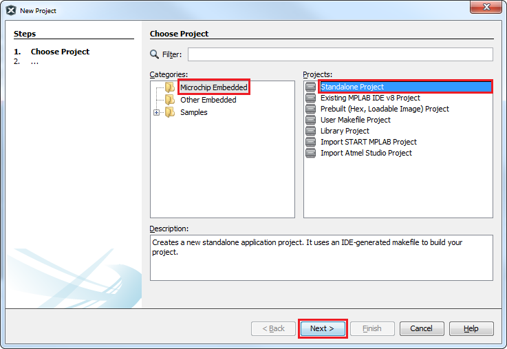

4. Selecct the __PIC18F45K50__ device and click *Next*.

   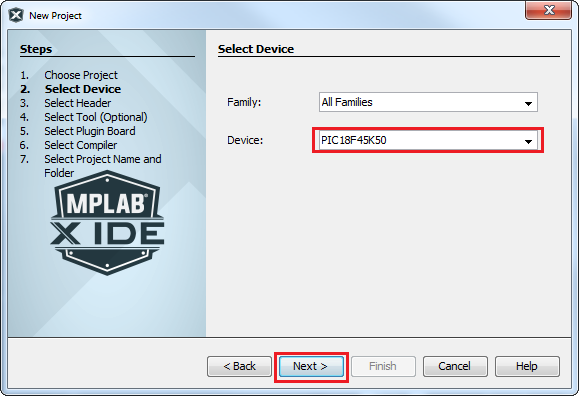

5. Choose the *Curiosity* option and click *Next*.

   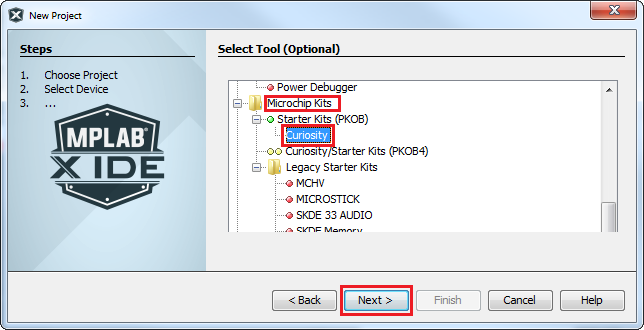

6. Choose the *XC8 Compiler Toolchain* to build the program and click *Next*.
   * If the XC8 Compiler is not installed, download it and install it from the official [Microchip Compilers website](https://www.microchip.com/en-us/development-tools-tools-and-software/mplab-xc-compilers).

   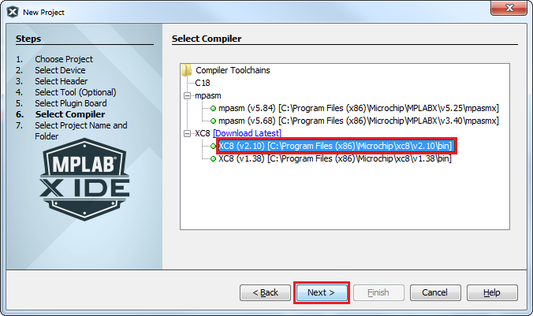

7. Choose the project location and project name. __Make sure that the project location path, directory and project name have no special characters and/or black spaces__. Then click *Finish*.

   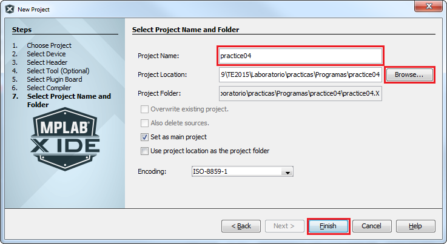

8. Right-click on *Source Files* and open a new `main.c` file; then, click *Finish*.

   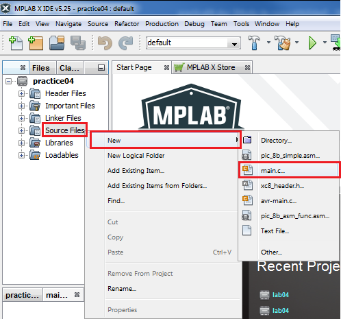
   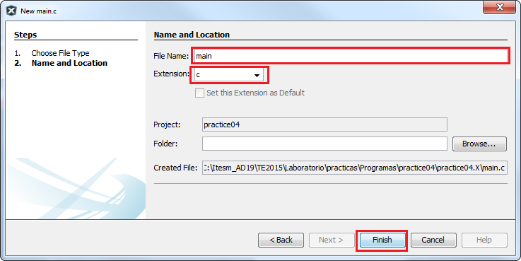

9. Your code must be like the one showed in the figure 16, appended at the end of the document.
10. Download `device_config.h` C header file from the repository and save it on your project directory. 

   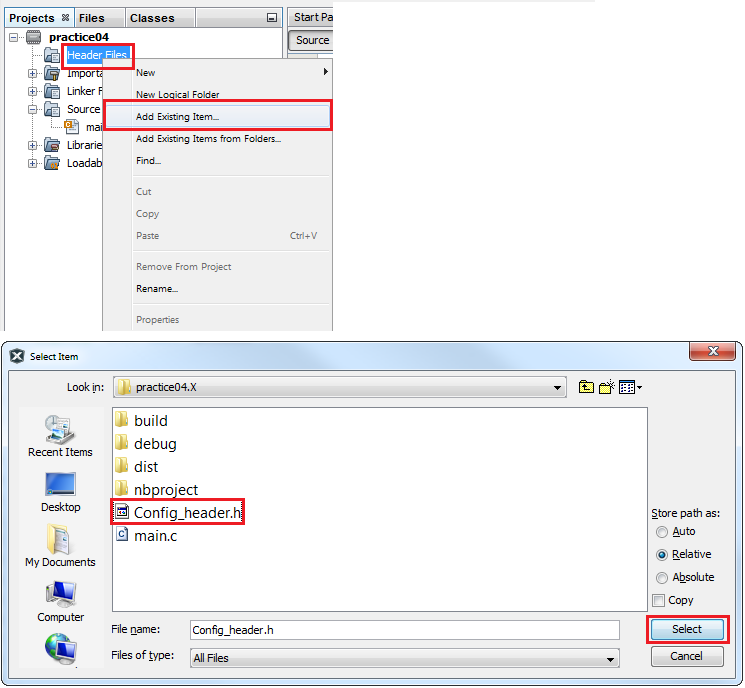

11. Right-click on *Header Files* and select *Add Existing Item*. Choose the downloaded file and click *Select*.

   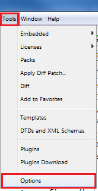

12. Under the *Tools* menu, select *Options*.

   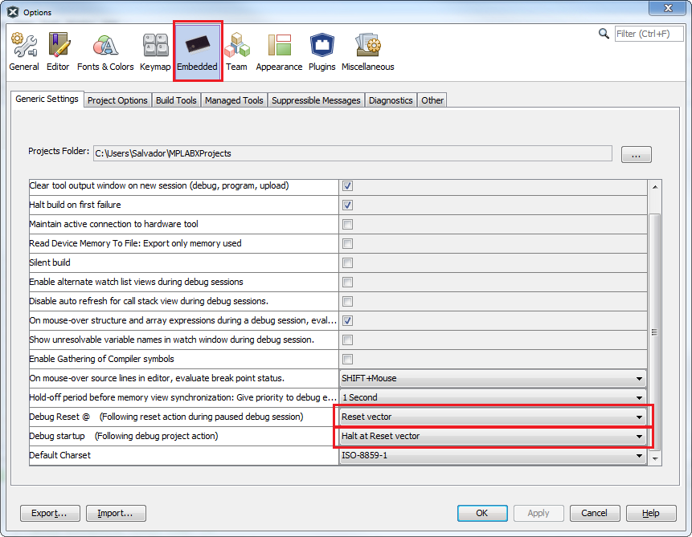

13. Click on the *Embedded* tab and choose the following options: 
    - Debug Reset: __Reset vector__
    - Debug Start: __Halt at Reset vector__
14. Go to *File* and select *Project Properties*. 

   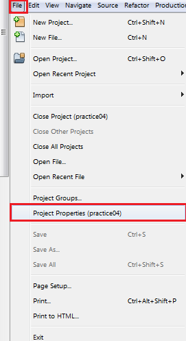
   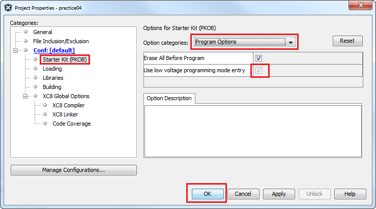

15. Ensure that *Low voltage programming mode* option is checked.

   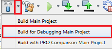

16. Select *Build for Debugging Main Project*.

   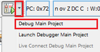

17. Then, select *Debug Main Project*.

   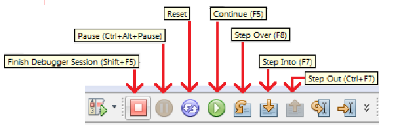

18. You can use the debug buttons to execute instruction by instruction from beginning to end, one step at the time, through the entire program.

   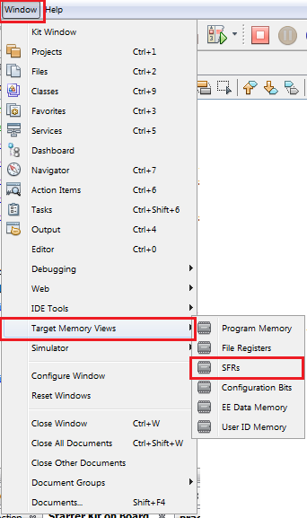

19. Before start, activate the windows that let us to see what is happening inside your microcontroller. On this window you can select what you want to verify; for example, general purpose file registers (GPRs), Special file registers (SFRs), etc.
20. Now debug the program by executing the code step-by-step. 