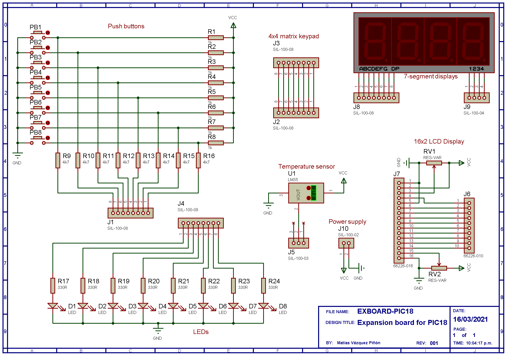
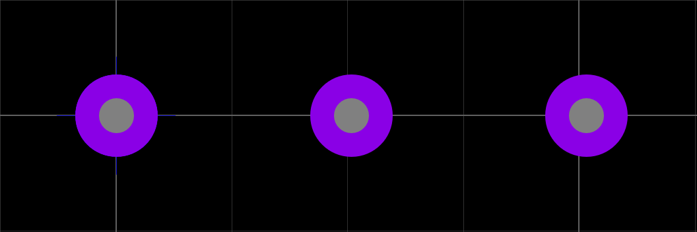

# Expansion Board Fabrication (Part II: PCB Layout)

## Lab work

1. Open the schematic capture of your project and double check that all the power nets of your design are named accordingly: VCC for +5 V and GND for 0 V. As an example, the power supply pins of the board should look like the figure below:

  

The final schematic should look similar to the one shown below: 

  

2. It is mandatory to configure the power rails before proceeding laying out the PCB. To do this, go to _**Design → Configure Power Rails...**_, and on the _**Power Rails**_ tab, all the power supplies used in your project will be visible on the drop down menu under tag _**Name**_ (1). Also, verify that all the signals have assigned the class __*POWER*__ (2).

  

3. Check the _**Unconnected power nets**_ field and in case you see there any listed net, add it to the corresponding net class, either VCC/VDD or GND. This way, all the nets that belong to the same class will be part of the same node, even though they are named differently. 

4. Open now the __*Net Class*__ tab. Here we configure the tracks width for the PCB. As you know from steps 1, 2 and 3, we have a __*POWER*__ net class, which connects all the power supply nets along the circuit, thus driving high current magnitudes. The second net class in our circuit is the __*SIGNAL*__ class, which connects all the tracks that drive low-current signals, such as port connections between the board and the &mu;C. Since _**SIGNAL**_ nets can be narrower than __*POWER*__ nets (because they drive lower currents), we can configure the tracks width for both clases to save space on the PCB.

5. Select _**SIGNAL**_ on the _**Net Class**_ drop down menu, and choose _**T10**_ for __*Trace Style*__. This means that all the signal tracks will be routed using a track width of 10 mils. __*1 mil equals 1 thousandth of an inch, or 0.0254 mm*__, thus 10 mils = 0.254 mm. According to the Copper thickness of our board, which is 35 &mu;m, a track with a cross-section of 0.254 mm × 35 &mu;m is able to drive around 300 mA, which is enough for our application ([see further information about track width design](https://www.protoexpress.com/blog/trace-current-capacity-pcb-design/)).

6. Still under _**SIGNAL**_ Net Class, select a _**T6**_ Neck Style and a _**DEFAULT**_ Via Style. 

7. Change to _**POWER**_ Net Class and choose _**T30**_, _**(None)**_ and _**DEFAULT**_ for Trace Style, Neck Style and Via Style, respectively.

8. Click the _**Design Explorer**_ button to see the component list of your design. Check out devices with missing package or excluded from the PCB. These include the LEDs, RES-VAR (potentiometers) and the push-buttons. We need to assing or create a package for these devices. The rest of components should have an assigned package already. 

  

9. Go back to _**Schematic Capture**_ window and right-click on any of the LEDs on your schematic diagram. Select _**Make Device**_ and click *Next* to the _**Packagings**_ section.

10. Click on _**Add/Edit**_ button and on the pop-up window, click _**Add**_ again. On the _**Keywords**_ field. search for __LED__, and under _**Miscellaneous**_ category, select the following device and click _Ok_:

Device | Library | Description
:---: | :---: | :---:
LED | PACKAGE | Light Emitting Diode, 100th pitch, A-K pinout

11. Once added to the component, assing the corresponding pins to the Anode and Cathode using an A and a K, respectively, as shown below (package pads should color white if done correctly):

  

12. Click _**Assign Package(s)**_ to close the pop-up windown, and click _Next_ three times and finally _Ok_ to complete the process. All the LEDs on your design should update with the PCB package automatically. 

13. To verify that the package was correctly assigned, double-click on any LED component of your design and check that the _**PCB Package**_ field is filled out with the _**LED**_ package name; if so, the package was correctly assigned. 

### Package creation

14. We will now create the PCB package for the push-buttons and the potentiometers, since no pre-defined packages are available in Proteus for these components. For this, switch to the _**PCB Layout**_ window.

15. Uncheck the _**Toggle Metric/Imperial**_ button to work with imperial units system. Then, select _**View → Snap 50th**_ for a 50 mil PCB grid. 

16. Starting off with the potentiometer, the commonly-available devices have three pins, 30 mils wide, and separated by 200 mils. We will use three 70 mils-wide pads with inner 30 mils holes to place the pot pins. From the toolbar to the left of the _**PCB Layout**_ window, click the _**Round Through-hole Pad Mode**_ and select _**C-70-30**_ and place a pad on coordinate X=0, Y=0. Then, move the cursor four position to the right (X=200 and Y=0), and place a second pad. Finally, place a third pad on X=400, Y=0. Figure below shows the three laid down 60-30 pads.

  

17. Select the _**2D Graphics Box Mode**_ and then select the _**Top Silk**_ layer from the PCB layers drop-down menu at the bottom of the screen. We will use this layer to draw the boundaries of the potentiometer to avoid overlapping with other components. 

18. Draw a 640 width x 300 height rectangle (you need to switch to a finer grid to allow 5 mils steps. For this, press F2 or _**View → Snap 5th**_). Draw a second rectangle, this time 260 width x 650 height. Place the rectangles to form the outline of the potentiometer. Consider that the top border of the first rectangle is placed 100 mils above the midline of the three pads. As a reference see the figure below:

  

19. Double-click on the leftmost pad and on the _**Number**_ box, assign _**1**_. Finish up assigning _**2**_ and _**3**_ to the following pads from left to right, respectively. Once assigned, you should see the number over the corresponding pad. 

20. Select the complete package, including pads and outlines, right-click and select _**Make Package**_ from the pop-up menu. On the _**Make Package**_ window name the package as _**POT**_, and save it to the _**USERPKG**_ library under the _**Discrete Components**_ category, _**Through Hole**_ package type, and _**Resistors**_ Package sub-category. Figure below shows the corresponding selections.

  

21. Go back to the _**Schematic Capture**_ view and assign the new package to the potentiometers on your design the same way as previously done for the LEDs; however, this time look up for the _**POT**_ package. If you are asked to save the packages of your design to a library, select _**USRDVC**_.

22. Now, create the package for the push-buttons. Consider that these devices have four terminals; however, the two upper legs belong to one node, and the two lower legs below to a second node. Legs width is 30 mils, thus use _**C-70-30**_ round pads. Furthermore, upper legs are separated 200 mils from one another, as well as lower legs. Upper legs are separated from lower legs by 300 mils. Finally, the body is a 220 mils width square. Your package should look similar to the one below:

  

23. Name your package as _**PUSH-BUTTON**_ and save it under _**Miscellaneous**_ category, _**Through Hole**_ type, and _**Switches**_ sub-category.

24. Assign the new package to the push-buttons on your schematic diagram. Usually, pins from the PCB are assigned on opposite corner to allow signal/power tracks to pass through the button pads. For this, assign pin 1 to pad 1, and pin 2 to pad 4 (leave pads 2 and 3 unconnected), as shown below:

  

25. Make the package for the 4-digit 7-segment display. Use round _**C-70-30**_ pads and the device outline is a 2000 mils x 750 mils rectangle. Name your package as _**4D-7SEG**_ and save it under _**Miscellaneous**_ category, _**Through Hole**_ type, and _**7 Segment Displays**_ sub-category. The _**Package Device**_ window below shows the package dimensions and the pin-to-pad assignments. 

  

26. The last step before proceeding to laying out the PCB, is to include the push-buttons and the 7-segment display into the PCB layout, since these components are excluded by default. Right-click on **each** push button and the display on your schematic, select _**Edit Properties**_ and uncheck __*Exclude from PCB*__ box. **This has to be done for all the push buttons and the 7-segment display on your schematic**.

27. Check the _**Design Explorer**_ to verify that now all the components have an assigned package. If so, move on and open the _**PCB Layout**_ window. Is any component on the schematic is missin on the _**Design Explorer**_, check that such component has a _**Part Reference**_ assigned on the _**Edir Properties**_ of the schematic view. 

### Circuit layout

28. Select and delete the packages you just created (they are already saved in a library). 

29. From the toolbar on the left, click on the _**2D Graphics Box Mode**_ and select _**Board Edge**_ as the current PCB layer. Then, enable the _**Toggle Metric/Imperial**_ button to work with the metric system. Draw a 150 mm x 100 mm rectangle to define our board area. 

30. Now, click the _**Component Mode**_ button. A list of all the components from your schematic capture will be displayed. From this list, start off by placing within the board limits the push-buttons and corresponding resistors to the board. You can rotate the packages pressing "_**+**_" on your keyboard. Continue by placing the rest of components of your board until all are within the board limits and the Components list is empty. Notice green wires making connections between components. 

  

31. Once all components placed, you can start routing your board. To do so, click the _**Auto-router**_ button, leave the default setup and click _**Begin Routing**_. Keep track of the CRC errors on the status bar at the bottom of the window. If unrouted tracks are shown, move the components close to the unrouted track and start over the routing process. Continue until _**No CRC erros**_ and _**No DRC errors**_ is displayed on the status bar, as shown below:

  

32. Your board shown show all the tracks routed on layer _**Bottom Copper**_, which displays in dark blue, similar to the figure below:

  

33. To finish off the layout process, add a power plane. For this, go to _**Tools → Power Plane Generator**_. Select _**GND=POWER**_ as the _Net_, _**Bottom Copper**_ as the _Layer_, and leave the default boundary; then, click _Ok_. 

  

Blank areas will be filled out with the copper layer, which is connected to the _**GND**_ net. This serves as heat sink for the ground net and to speed up the routing process of the laser/CNC machine.

34. The final layout of your board should look similar to the PCB shown below:

  

35. Finally, generate the GERBER files, required for the fabrication of the board. Go to _**Output → Generate Gerber/Excellon Files**_. A final test will be asked to be carried out. Click _Yes_. The report should show no errors at the end.

  

36. On the _**CADCAM Output**_ window, select _**Bottom Copper**_, _**Top Silk**_, _**Bottom Resist**_ and _**Drill**_ layers only on the _Layers_ section. Choose a saving folder, select _**Output to a single ZIP file?**_ and check _**Automatically open output folder**_ and _**Automatically open ZIP file**_. Finally, on _**Gerber format**_ section, select _**RS274X**_ and click _OK_.

  

## Report

The generated ZIP file contains all the Gerber files required for the board fabrication. Upload to Github/Drive this ZIP file and share the download link. 