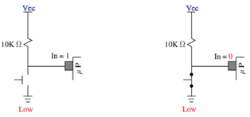
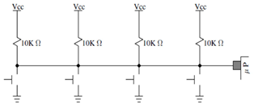
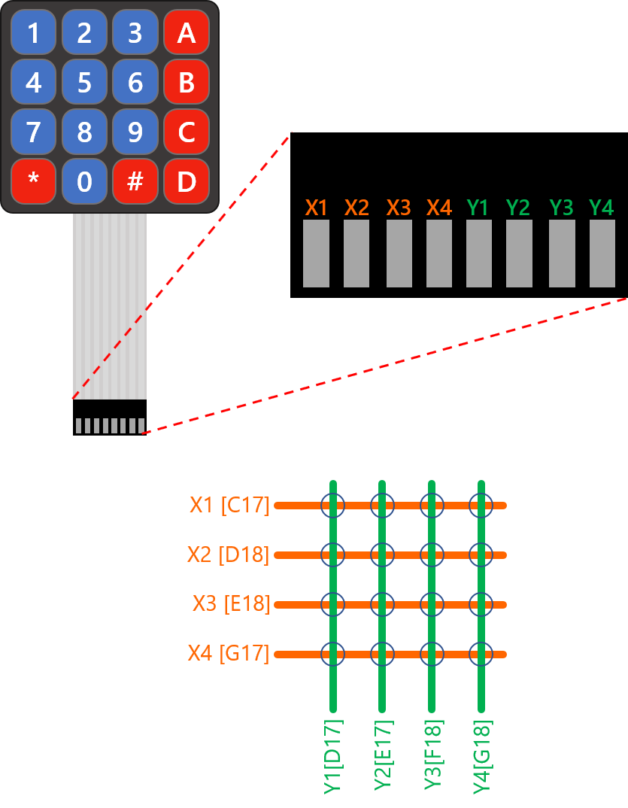

Find support at 

<!--- https://naereen.github.io/badges/ --->

# 4x4 Matrix Keypad Driver

## Objectives
In this laboratory, the student will develop a 4x4 keypad driver for the PIC18 &mu;Controller, and display the corresponding key value on the 7-segment display. For this, the following objectives have to ve cleared:
* Implement a sweeping routine to acquire 16 data values from a 4x4 keypad using 8 input/output pins.
* To know the function and interactions between the pull-up resistor and input/output ports of a device. 

## Introduction
Pull-up resistors are used to temporarily force the voltage of a node to a know value, such as VCC. This is due to the open-circuit voltage as seen from the node itself (see left side of the figure below). Once a switch short-circuits such node to GND, the node is consequently forced to a 0 V value. From the digital logic perspective, we can state that when the switch is open, the node (thus the &mu;C input pin in the figure below) has a logic 1, and when the switch is closed (button pressed), the node and the input pin have a logic 0.

The working principle of a matrix keypad is that it connects several switches to a single input of a microcontroller, and the driver is in charge of identifying which key is pressed by multiplexing the signals that power up the buttons. A basic schematic diagram for a 1-row, 4-columns keypad is shown below:

The same case applies for the case of more than one row. If we have four rows and four columns, 8 pins from the &mu;C are required: 4 for multiplexing either rows or columns, and 4 for reading for a pressed key.

Assuming the top row is Row 1, and leftmost column is Column 1, the combinations for each key of the 4x4 keypad would correspond to the table below:

Key | Output | Input
:---:  | :---: | :---:
1  | Row 1 `[ 0111 ]` | Column 1 `[ 0111 ]`
2  | Row 1 `[ 0111 ]` | Column 2 `[ 1011 ]`
3  | Row 1 `[ 0111 ]` | Column 3 `[ 1101 ]`
A  | Row 1 `[ 0111 ]` | Column 4 `[ 1110 ]`
4  | Row 2 `[ 1011 ]` | Column 1 `[ 0111 ]`
5  | Row 2 `[ 1011 ]` | Column 2 `[ 1011 ]`
6  | Row 2 `[ 1011 ]` | Column 3 `[ 1101 ]`
B  | Row 2 `[ 1011 ]` | Column 4 `[ 1110 ]`
7  | Row 3 `[ 1101 ]` | Column 1 `[ 0111 ]`
8  | Row 3 `[ 1101 ]` | Column 2 `[ 1011 ]`
9  | Row 3 `[ 1101 ]` | Column 3 `[ 1101 ]`
C  | Row 3 `[ 1101 ]` | Column 4 `[ 1110 ]`
\* | Row 4 `[ 1110 ]` | Column 1 `[ 0111 ]`
0  | Row 4 `[ 1110 ]` | Column 2 `[ 1011 ]`
\# | Row 4 `[ 1110 ]` | Column 3 `[ 1101 ]`
D  | Row 4 `[ 1110 ]` | Column 4 `[ 1110 ]`

<!---
AVAILABLE APPOINTMENTS
Full stack developer
Lead Embedded Design Engineer
FPGA design engineer
Digital systems architect
Electronics engineer
---> 

<!---
### Materials and software resources

Qty | Material 
:---: | :---
1 | Curiosity board
1 | Expansion board
1 | 4x4 matrix keypad
4 | 220&Omega; resistor
| | MPLAB X IDE 

<!---
## Pre-lab work
--->

## Procedure

### __1. Hardware setup__
Connect the corresponding ports of the PIC18 &mu;C to the appropiate pinheaders of your expansion board, as well as the 4x4 matrix keypad. Use the table below as a reference for your connections.

&mu;C Port | Type | Peripheral
:---: | :---: |:---:
A [0 to 3] | Input | Keypad [0 to 3]
A [4 to 7] | Output | Keypad [4 to 7]
B [0 to 4] | Output | 7-segment display, cathodes [D4, D3, D2, D1]
D [0 to 7] | Output | 7-segment display, anodes [ABCDEFGP]

The final schematic of the circuit is shown below:

### __2. Firmware development__    

1. Open the `LAB05_display.X` MPLAB X project; this is the starting point for your labwork. This project contains a 4-digit 7-segment display driver, which displays four different numbers on each dislpay digit, respectively. 

2. The base MPLAB X project makes use of the following two functions (already written):

   1. `char_to_seg()`. Unsigned char to 7-segment encoder. Converts the four least-significant bits of an 8-bit binary value stored in a `uint8_t` variable, into an 8-bit value corresponding to the 7-segment codification, stored in a `uint8_t` variable. [Use the BCD to 7-segment encoding table](7-seg_encoding.md) as a reference.

   2. `send_to_disp()`. Breaks down a 32-bit word (`uint32_t`) containing four 8-bit binary numbers (`0x01 + 0x02 + 0x03 + 0x04`), encodes each 8-bit digit by calling `char_to_seg()` function, and sends the encoded byte to the 7-segment display.

3. With this base project, do the following:

   1. Program your device and observe what is displayed. As you will see, each digit is turned on in a sequence (right to left) each time step, while the rest remains off. This way, instead of using 8 pins (7 segments and decimal dot) + 1 pin (enable) to drive one 1-digit display in parallel, which would add up to 36 pins for four digits, we used multiplexed outputs to enable only one digit each time and assign the corresponding value to that digit using the same 8 segment bits for all four digits. This is common practice to drive 7-segment displays using &mu;Cs, FPGAs and other devices. To be able to see all digits _on_ at the same time, the sweeping frequency should be high enough, such as the human eye cannot detect when the segments turn off. 
      
      * Reduce the value of the macro `SWEEP_STEP` on _line 8_, to a step value where you consider the four digits are displayed at the same time. Report this value.
      * Also, change the value of the `num` variable on _line 28_ to display the numbers A, B, C and D instead pf those displaying from the original project. Consider this should be in BCD format for numbers between 0x0 and 0xF. Show the displayed numbers in your report.

4. Write the function `key_scanner()` to scan for a pressed key on the keypad. Your function must fulfill the following requirements:

   * `key_scanner()`. Sweeps each keypad row from top to bottom (bits `0` through `3` of **Port A**, configured as **outputs**), and scans the columns from left to right (bits `4` to `7` of **Port A** configured as **inputs**) to detect for a pressed key. Notice that the keypad has hard-wired _*pull-up*_ resistors tying column inputs to VCC when a key is not pressed, and short-circuiting these pins to GND when a key is pressed (_a.k.a._ inverted digital logic). The function returns a `char` value corresponding to the pressed key (from `0x00` to `0x0F`). No input arguments are required.

3. Write the corresponding code in `main()` function to show the numeric value of the pressed key on the keypad, on the 4-digit 7-segment display of your expansion board. Consider the following restrictions: 
      
    * The _*#*_ symbol must show the `0xE` value (`0b1110`), and the __*__ symbol must show the `0xF` value (`0b1111`).

    * When a key is pressed, the number/letter value should be showed in the least significant digit of the 7-segment display (rightmost digit).
    
    * When another key is pressed afterwards, the previous digit should be left-shifted, and the new value should take place on the least significant digit.

4. Test your driver on the Curiosity board and record a demonstrative video presenting the display as it shows the corresponding digits as the keys on the keypad are pressed. 

## Deliveries
1. Turn in a technical report that includes worthwhile details about your lab work. Your report must be elaborated according to the [Formal Lab Report Grading Rubric](https://experiencia21.tec.mx/courses/130808/pages/rubrica-de-reportes-de-laboratorio), thus is strongly suggested to review the rubric before submitting your report and make sure you include all the required information. Your report should include the following sections:
   1. Procedures
   2. Results
   3. Individual conclusions
   4. References

2. Complete the _Self & Peer Assessment for Lab 5_, which will allow you to rate your and your teammates' performance during the lab work. **This assessment will be considered** to assign individual grades for Lab 5. You will receive an e-mail with a personalized link to fill out your assessment __after__ the report submission due date has passed. 