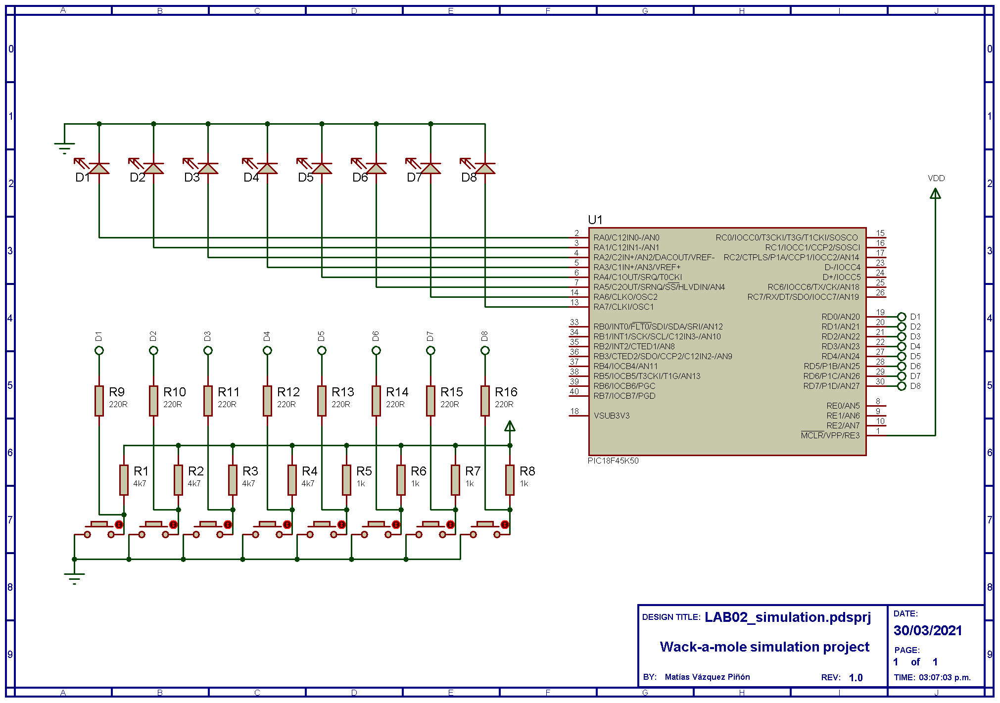

Find support at 

<!--- https://naereen.github.io/badges/ --->

.

# 4x4 Matrix Keypad Driver (draft)

## Objectives
In this laboratory, the student will develop a 4x4 keypad driver for the PIC18 &mu;Controller, and display the corresponding key value on the 7-segment display. For this, the following objectives have to ve cleared:
* Implement a sweeping routine to acquire 16 data values from a 4x4 keypad using 8 input/output pins.
* To know the function and interactions between the pull-up resistor and input/output ports of a device. 

## Introduction
This laboratory is broken down into three assignments that are distributed among all team members. Each team member has the responsability to complete their individual assignment and explain their part of the code on the demonstration video. Moreover, the whole team is in charge of integrating the final design into a single project and carry out the corresponding firmware and hardware tests. 

Team member | Appointment | Assignment | % Responsability
:---: | :--- | :--- | :---:
Student 1 | Front-end developer | `key_scanner()` | 1/3
Student 2 | Front-end developer | `main()` | 1/3
Student 3 | Back-end developer | System verification | 1/3

<!---
AVAILABLE APPOINTMENTS
Full stack developer
Lead Embedded Design Engineer
FPGA design engineer
Digital systems architect
Electronics engineer
---> 

The MPLAB X project makes use of the following two functions:

1. `char_to_seg()`. Unsigned char to 7-segment encoder. Converts the four least-significant bits of an 8-bit binary value stored in a `uint8_t` variable, into an 8-bit value corresponding to the 7-segment codification, stored in a `uint8_t` variable. [Use the 7-segment encoding table](7-seg_encoding.md) as a reference.

2. `send_to_disp()`. Breaks down a 32-bit word (`uint32_t`) containing four 8-bit binary numbers (`0x00 + 0x00 + 0x00 + 0x00`), encodes each 8-bit digit by calling the `uint8_t char_to_seg(uint8_t)` function, and sends the encoded byte to the display.

From here, you will write the `key_scanner()` function that fulfills the following requirements:

3. `key_scanner()`. Sweeps each keypad row from top to bottom (bits `0` through `3` of Port A, configured as **outputs**), and scans the columns from left to right (bits `4` to `7` of Port A configured as **inputs**) to detect for a pressed key. Notice that the keypad has hard-wired _*pull-up*_ resistors tying column inputs to VCC when a key is not pressed, and short-circuiting them to GND when the key is pressed (_a.k.a._ inverted digital logic). The function returns a `char` value corresponding to the pressed key (from `0x00` to `0x0F`). No input arguments are required.

### Materials and software resources

Qty | Material 
:---: | :---
1 | Curiosity board
1 | Expansion board
1 | 4x4 matrix keypad
4 | 220&Omega; resistor
| | MPLAB X IDE 

<!---
## Pre-lab work
--->

## Procedure

### __1. Hardware setup__
Connect the corresponding ports of the PIC18 &mu;C to the appropiate pinheaders of your expansion board, as well as the 4x4 matrix keypad. Use the table below as a reference for your connections.

&mu;C Port | Type | Peripheral
:---: | :---: |:---:
A [0 to 3] | Input | Keypad [0 to 3]
A [4 to 7] | Output | Keypad [4 to 7]
B [0 to 4] | Output | 7-segment display, cathodes [D4, D3, D2, D1]
D [0 to 7] | Output | 7-segment display, anodes [ABCDEFGP]

The final schematic of the circuit is shown below:

### __2. Firmware development__    

1. Open the `LAB05_display.X` MPLAB X project; this is the starting point for your labwork. This project contains a 4-digit 7-segment display driver, which displays four different numbers on each dislpay digit, respectively. With this base project, do the following:

   1. Program your device and observe what is displayed. As you will see, each digit is turned on in a sequence (right to left) each time step, while the rest remain off. This way, instead of using 8 pins (7 segments and decimal dot) + 1 pin (enable) to drive one 1-digit display in parallel, which would add up to 36 pins for four digits, we used multiplexed outputs to enable only one digit each time and assign the corresponding value to that digit using the same 8 segment bits for all four digits. This is common practice to drive 7-segment displays using &mu;Cs, FPGAs and other devices. To be able to see all digits "on" at the same time, the sweeping frequency should be high enough, such as the eye cannot detect when the segments turn off. 
      
      * Reduce the value of the macro `SWEEP_STEP` on _line 8_, to a step value where you consider the four digits are displayed at the same time. Report this value.
      * Also, change the value of the `num` variable on _line 28_ to display the numbers A, B, C and D instead pf those displaying from the original project. Consider this should be in BCD format for numbers between 0x0 and 0xF. 

2. Write the function `key_scanner()` to scan for a pressed key on the keypad. 

3. Write the corresponding code on `main()` to show the numeric value of the pressed key on the keypad, on the 4-digit 7-segment display of your expansion board. Consider the following restrictions: 
      
    * The _*#*_ symbol must show the `0xE` value (`0b1110`), and the __*__ symbol must show the `0xF` value (`0b1111`).

    * When a key is pressed, the number/letter value should be showed in the least significant digit of the 7-segment display (rightmost digit).
    
    * When another key is pressed afterwards, the previous digit should be left-shifted, and the new value should take place on the least significant digit.

4. Test your driver on the Curiosity board and record a demonstrative video presenting the display as it shows the corresponding digits as the keys on the keypad are pressed. 

## Report
Elaborate a technical report that includes the following sections
1. __Introduction.__ A brief explanation of the work done in this lab (~100 words). Include a short paragraph of your results where you attach:
   * the link to GitHub repository with your MPLAB project files, and
   * the link to the demostrative video
2. __Lab Procedure and Results.__ In-deep explanation of the lab procedure and coding process of functions. 
3. __Individual conclusions.__