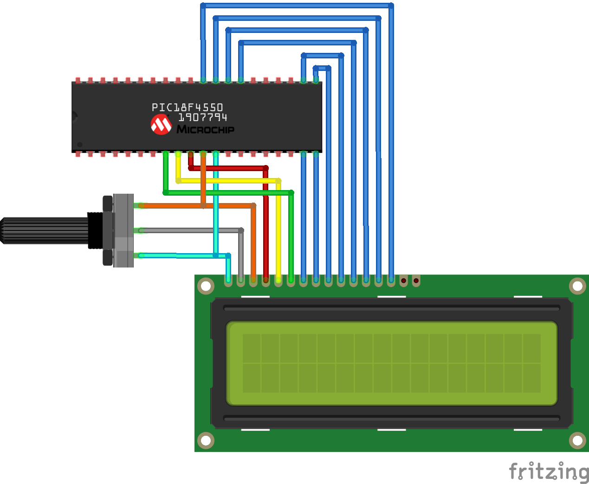
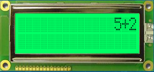
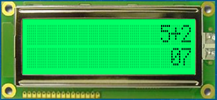

# Laboratory 6. LCD Display Driver

## Objectives
To write a general-purpose 16x2 LCD display driver for the PIC18 &mu;C and use it, along with the previously-developed 4x4 keypad driver, to implement a simple calculator on the Curiosity development board. 

## Introduction
The device has 2 lines and 16 characters per line. The LCD pinout is shown below:

<div align="center">

Pin number | Symbol | Level | I/O | Function
:---: | :---: | :---: | :---: | :---: 
1 | V<sub>SS</sub> | - | - | Power supply (GND)
2 | V<sub>CC</sub> | - | - | Power supply (+5V)
3 | V<sub>EE</sub> | - | - | Contrast adjustment
4 | RS  | 0/1 | I | 0 = Instruction input, 1 = Data input
5 | R/W | 0/1 | I | 0 = Write to LCD, 1 = Read from LCD
6 | E   | 1, 1→0 | I | Enable
7  | D0  | 0/1 | I/O | Databus line 0 (LSB)
8  | D1  | 0/1 | I/O | Databus line 1 
9  | D2  | 0/1 | I/O | Databus line 2
10 | D3  | 0/1 | I/O | Databus line 3
11 | D4  | 0/1 | I/O | Databus line 4
12 | D5  | 0/1 | I/O | Databus line 5
13 | D6  | 0/1 | I/O | Databus line 6
14 | D7  | 0/1 | I/O | Databus line 7
</div>

The following diagram shows the wiring of the LCD for powering and &mu;C data transmission:

<div align="center">


</div>

Then, the handshaking protocol for the LCD is detailed next:

<div align="center">


</div>


<div align="center">

Bit name | Value on `0` | Value on `1` 
:--- | :--- | :---
I/D | Decrement cursor position | Increment cursor position
S   | No display shift | Display shift
D   | Display off  | Display on
C   | Cursor off | Cursor on
B   | Cursor blink off | Cursor blink on
S/C | Move cursor | Shift display
R/L | Shift left | Shift right
DL  | 4-bit interface | 8-bit interface
N   | 1/8 or 1/11 duty (1 line) | 1/16 duty (2 lines)
F   | 5x8 dot matrix | 5x10 dot matrix
BF  | Can accept instructions | Internal operation in progress
</div>

The 44780 standard requires 3 control lines as well as either 4 or 8 I/O lines for the data bus. The user must select whether to operate the LCD with a 4-bit data bus or an 8-bit data bus. If a 4-bit data bus is used, the LCD will require a total of 7 data lines (3 control lines + 4 data bus lines). Whereas the 8-bit data bus is chosen, the LCD requires 11 lines (3 control lines + 8 data bus lines). The three control lines are referred to as __E__, __RS__ and __R/W__.

1. The __E__ line is the __Enable__. This control line is used to tell the LCD that you are sending data. In this case, your program should first set this line high (_e.g._, `1`) and then set the other two control lines and/or set the data bus. Once the rest of lines are set, `E` must be set low again (`0`). The `1→0` transition tells the 44780 to take input data currently found on the other control lines and the data bus, and to treat it as a command.

2. The __RS__ line is the __Register Select__. When low (`0`), data is treated as a command or special instruction (such as clear screen, position cursor, etc.). However, when high (`1`), data sent is interpreted as text that should be displayed on the screen (_e.g._,, to display the letter `T` on the screen, you would set high __RS__.

3. The `R/W` line is the __Read/Write__ bit. When low, the information on the data bus is being written to the LCD. When high, the program is effectively querying (or reading) from the LCD. Only one instruction (`Get LCD status`) is a _read_ type command. All others are write commands, so `RW` will almost always be low.

__It is strongly advised__ to use a LCD display simulator to help understand the operation of the 44780 driver before coding the driver for this laboratory. Try using the simulator linked below to write the team members' first name on each line of the display:

<div align="center">

[](http://www.dinceraydin.com/djlcdsim/djlcdsim.html)
</div>

### __Configuration example__
The LCD requires either 8 or 11 I/O lines to transmit data. This is an 8-bit data bus example. For the program to access the LCD, create macros of the PIC18F ports to identify the lines by their 44780 name:
```C
#define LCD_DATA_R          PORTD
#define LCD_DATA_W          LATD
#define LCD_DATA_DIR        TRISD
#define LCD_RS              LATCbits.LATC2
#define LCD_RS_DIR          TRISCbits.TRISC2
#define LCD_RW              LATCbits.LATC1
#define LCD_RW_DIR          TRISCbits.TRISC1
#define LCD_E               LATCbits.LATC0
#define LCD_E_DIR           TRISCbits.TRISC0
```
Then, the following instruction illustrates how the macros are used to define the output levels for the port bits. For example, to set the __RW__ line high (1), the following instruction can be used: 
   
    LCD_RS = 1;

### __Handling the *E* control line__

The __E__ line is used to tell the LCD to execute an instruction available on the data bus. It must be set high before an instruction and set low after the instruction. The __E__ line must be manipulated whether the instruction is a read/write or if is text/instruction.

Use this instruction to set `E` high:  
    
    LCD_E = 1;

Or this instruction to set `E` low:   
    
    LCD_E = 0;

__Programming hint:__ The LCD interprets and executes a command at the instant the **E** is set low. If the __E__ is at low state, instructions are not executed. Moreover, the LCD requires an amount of time to execute an instruction after setting __E__ low. The amount of time required for instruction execution depends on the instruction and the speed of the crystal attached to the 44780’s oscillator input.

### __Checking the busy status on the LCD__
The `Get LCD Status` command determines whether the LCD is still busy executing the last instruction received. This command returns a flag through DB7: high level if the LCD is busy on current instruction execution and a low level if it is no longer busy and ready to receive and execute a new command. The function code is shown below:

```c
// Function to wait until the LCD is not busy
void LCD_rdy(void){
    char test;
    // configure LCD data bus for input
    LCD_DATA_DIR = 0b11111111;
    test = 0x80;
    while(test){
        LCD_RS = 0;         // select IR register
        LCD_RW = 1;         // set READ mode
        LCD_E  = 1;         // setup to clock data
        test = LCD_DATA_R;
        Nop();
        LCD_E = 0;          // complete the READ cycle
        test &= 0x80;       // check BUSY FLAG 
    }
}
```
An instruction must first be sent to the LCD and then call the `LCD_rdy()` function to wait until the instruction is completely executed by the LCD. This ensures the program gives the LCD the time it needs to execute instructions and also makes programs compatible with any LCD, regardless of how fast or slow it might process instructions.

### __LCD initialization__
The LCD must be initialized and configured before displaying data. This is accomplished by sending a few initialization instructions to the LCD. The first instruction indicates to the LCD the type of communication: and 8-bit or 4-bit data bus. The first instruction must also set the 5x8 dot character font. These two options are selected by sending the command `38h` to the LCD. The `RS` line must be low to a command to the LCD. The following instructions send the first command. The second initialization byte is the instruction `0Fh`. This instruction turns the LCD ON and the cursor ON. It is necessary to repeat part of the sequence described in the code below:

```c
// LCD initialization function
void LCD_init(void){
    LATC = 0;               // Make sure LCD control port is low
    LCD_E_DIR = 0;          // Set Enable as output
    LCD_RS_DIR = 0;         // Set RS as output 
    LCD_RW_DIR = 0;         // Set R/W as output
    LCD_cmd(0x38);          // Display to 2x40
    LCD_cmd(0x0F);          // Display on, cursor on and blinking
    LCD_cmd(0x01);          // Clear display and move cursor home
}
```
The function `LCD_cmd` is as follows:
```c
// Send command to the LCD
void LCD_cmd(char cx) {
    LCD_rdy();              // wait until LCD is ready
    LCD_RS = 0;             // select IR register
    LCD_RW = 0;             // set WRITE mode
    LCD_E  = 1;             // set to clock data
    Nop();
    LCD_DATA_W = cx;        // send out command
    Nop();                  // No operation (small delay to lengthen E pulse)
    LCD_E = 0;              // complete external write cycle
}
```
Write text (sends a character to the LCD) to the LCD is shown next:
```c
// Function to display data on the LCD
void send2LCD(char xy){
    LCD_RS = 1;
    LCD_RW = 0;
    LCD_E  = 1;
    LCD_DATA_W = xy;
    Nop();
    Nop();
    LCD_E  = 0;
}
```
The 44780 contains a certain amount of memory assigned to the display. All of the written text is stored in this memory, and the 44780 subsequently reads this memory to display the text on the LCD itself. The first character in the upper left-hand corner is at address `00h`. The following character position (character 2 on the first line) has address `01h`, and so on. This addressing continues until reaching the 16th character on the first line, which has address `0Fh`. However, the first character of line 2 has address `40h`. This means that if we write a character to the last position of the first line and then write a character following it, the second character will not appear on the second line. This is because the second character will effectively be written to address `10h`, whereas the second line begins at address `40h`. Thus, we need to send a command to the LCD that tells it to position the cursor on the second line. The `Set Cursor Position` instruction is `80h`. For this, we must add the address of the location where we wish to position the cursor, `80h + 40h = C0h`. Sending the command `C0h` to the LCD will position the cursor on the second line at the first character position.

## Procedure

### Harware setup
1. Wire up the 4x4 matrix keypad on your expansion board to port B of the PIC18 &mu;C. 
2. Wire up the LCD display on your expansion board to ports C and D of the &mu;C as follows:
   - Data bus (D0-D7) to Port D (RD0-RD7)
   - RC0 to E
   - RC1 to R/W
   - RC2 to RS

### Firmware development
3. Create a new project in the MPLAB X IDE for the Curiosity board (PIC18F45K50 &mu;C).
4. Create a C program to do the following:
   1. The program should take an arithmetic operator (__+, -, *, /__) and two operands from the 4x4 matrix keypad to carry out the corresponding calculation. The operator and operands should be shown on the LCD display.

<div align="center">


</div>

   2. When the user presses the __*__ from the keypad, the display clears the operation and writes the result from the calculation:

<div align="center">


</div>

   3. To carry out a new calculation, the user must press __#__. This action must clear the display an return the cursor home. Then, a new calculation can be entered.
   5. The range of the operands is between 0 and 9. Also, the result can only be a positive and integer number.
   6. Table below shows the mapping of the keypad symbols with the calculator implementation.

<div align="center">

Kaypad symbol | Arithmetic representation
:---: | :---:
0-9 | 0-9
A  |  +
B  |  -
C  |  *
D  |  /
\# | Clear display
\*  | Calculate
</div>

## Deliverables
1. Turn in a technical report that includes worthwhile details about your lab work. Your report must be elaborated according to the [Formal Lab Report Grading Rubric](https://experiencia21.tec.mx/courses/130808/pages/rubrica-de-reportes-de-laboratorio), thus is strongly suggested to review the rubric before submitting your report and make sure you include all the required information. Your report should include the following sections:

    1. Procedure
    2. Results
    3. Individual conclusions
    4. References

2. Complete the Self & Peer Assessment for Lab 6, which will allow you to rate your and your teammates' performance during the lab work. This assessment will be considered to assign individual grades for Lab 6. You will receive an e-mail with a personalized link to fill out your assessment after the report submission due date has passed.
