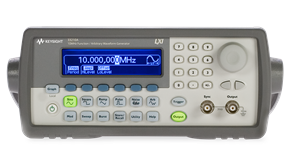
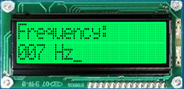
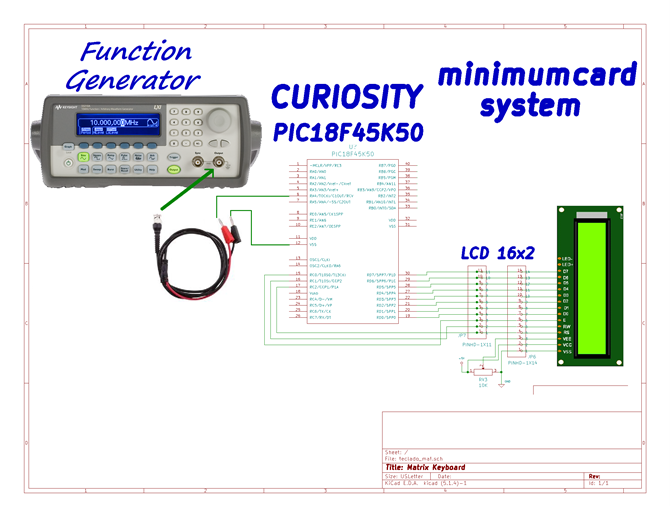

# Laboratory 7. Timers

## Objectives 
The student will write a C program implementing the timer module to count events and time intervals. At the end of this lab, the student will be capable of: 
- Make calculations for timing requirements in applications in order to configure and program the timers.
- Write different code routines for timing task such as event counter and time generator.

## Background
A waveform/function generator, see Fig. 1, is an instrument used in electronics that serves to generate or simulate specific signals with certain characteristics. For example, create or simulate a signal that can be square, sinusoidal, of a certain frequency, and of a certain amplitude. In this way, we can apply this generated signal to a circuit to see its response.

Function Generator Configuration:
- High impedance: 
    - `Utility → Output Setup → High Z → DONE`
- Signal Type: `Square`
- Amplitude:    `5 V peak to peak`
- Offset:  `2.5 V`

Time for roll over:

> __Time = (2TimerMode-TMRx)(Tcy)(Prescaler),__

where:
- `TMRx`: is the timer counter register.
- `Time`: is the period from _initial count_ in TMRx to the moment when `TMRx` has an overflow (from `0xFF/0xFFFF` to `0x00/0x0000`).
- `TimerMode`: it may be 16 or 8 bits.
- `Tcy`: internal Instruction Cycle of 4/Fosc.
- `Prescaler`: device for frequency divider.

## Lab Procedure. 

### Part A. `main.c` programming structure.
Remember to follow the programming structure presented in [3]:
1.	Start your C program with the “LIBRARIEs / HEADERs SECTION” section… 
2.	Continue your C code with the “DIRECTIVEs SECTION” section… 
3.	Next, write the “DATA TYPEs SECTION” section.
4.	Now, write the “FUNCTIONs DECLARATION” section…
5.	It is time for the “MAIN” section… 
6.	Last step is to write the “FUNCTIONs” section… 

### Part B.	Frequency measuring
7.	Create a new project in the MPLAB X IDE for the “Curiosity” board (PIC18F45K50 microcontroller). More details are presented in [3].
8.	Create a C program to measure the frequency of a function generator through the TIMER modules of the PIC18F45K50, and display the corresponding frequency value in the LCD display, as shown in Fig 2. More details about LCD are presented in [4].

9.	Constraints and indications:
    - You can not use the "delays.h" library.
    - The frequency range to read from the function generator is from 0 to 255 Hz.
    - Configure a TIMER for "roll over" in periodic intervals of 1 second.
    - Design a counter with the TIMER 0 module in order to detect the falling edges (frequency) that occur in 1 second.
    - First, Timer (e.g. TIMER 1) and Timer 0 must be enable almost at the same time (in fact first TIMER 1 and then TIMER 0) and after a interval of 1 second, the value of the TIMER 0 counter should be sent to the LCD display (because the count must correspond to the generator frequency).
    - Do not forget to reset the counters and clean the overflow flag of TIMER 1 (TMR1IF) at every second.
    - Your program must be able to continuously read and show the generator frequency in spite of generator changes its frequency value. In the LCD display, the ‘Frequency’ and ‘Hz’ labels must not disappear or been rewritten. The only replaced/rewritten characters should be the ‘values’.

### Part C. Hardware setup
10.	Configure the function generator as was shown in part II section C. Connect the Function Generator to the External Clock signal for TIMER 0 (RA4/T0CKI pin) of the PIC18. Make a connection to make common the PIC18 GND and the GND of the Function Generator. Connect the LCD display in the same fashion as done in Practice 7. Your final implementation must be like the one shown in figure 2 (check figure 2 at the end of this document.)

## Deliverables
1. Turn in a technical report that includes worthwhile details about your lab work. Your report must be elaborated according to the Formal Lab Report Grading Rubric, thus is strongly suggested to review the rubric before submitting your report and make sure you include all the required information. Your report should include the following sections:

    1. Procedure
    2. Results
    3. Individual conclusions
    4. References

2. Complete the Self & Peer Assessment for Lab 7, which will allow you to rate your and your teammates' performance during the lab work. This assessment will be considered to assign individual grades for Lab 7. You will receive an e-mail with a personalized link to fill out your assessment after the report submission due date has passed.

