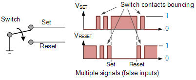
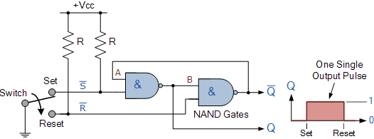
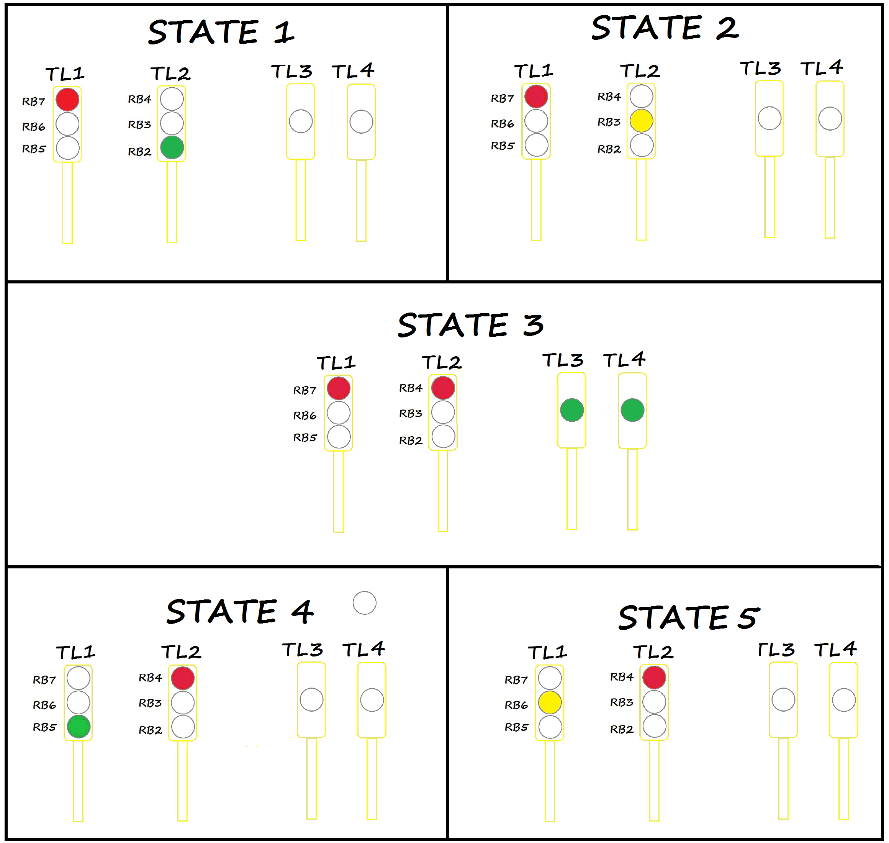
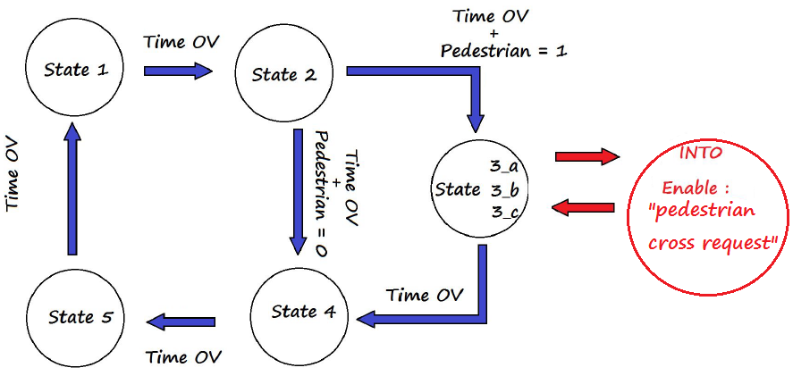

# Laboratory 8. Interrupts

## Objectives
The student will write a C language program where he will use the interrupt service routine (ISR) for attendance core and peripheral hardware events.

## Background
### __Interrupts__
An _interrupt_ is an event that will cause the CPU to stop the normal program execution and provide some service to the event. The solution for handling multiple pending interrupts is __to prioritize all interrupts__. 
1. The interrupt at the higher priority will be attended before than the interrupt at the lower priority. 
2. The PIC18 supports two-level interrupt priority only, and let the software to decide which pending interrupt to service. 
3. The PIC18 Interrupt sources are: the core group and peripheral group. 
   - For the first group we have four edge-triggered INT pins: INT0, INT1, INT2 and INT3 interrupts, and the TMR0 overflow interrupt. 
   - Port B pins change (anyone of the upper four Port B pins), 
   - For the second group we have On-chip peripheral function interrupts as A/D converter, USART transmit, Capture/Compare, etc.

### __Push button debounce__
When you push a button, ideally, you can imagine that a perfect "square signal" is generated, but this is actually not true. When a button is pressed, two metal terminals come into physical contact caused by the mechanical action applied by the user. Inside the switch packing, the terminals initially make contact; however, this heppens only for a brief fraction of a microsecond. Then, a second contact comes in by a little longer time, and then again a bit longer, and only then, the switch is fully closed. This means that the switch is bouncing between in-contact, and not in-contact, causing false inputs and abnormal or erroneous behavior, as shown below:

<div align="center">

</div>

To avoid this, we need to implement a debouncing system. There are several options, from RC (passive) arrangements to TTL (logic) implementations. The figure below shows a latch SR implementation for a debounce system, 

<div align="center">

</div>

And the C code version for push-button debouncing is presented below:
```c
void debounceSR (void){
   char set, reset, q;
   if (PORTBbits.RB2){
      set = 1;
      reset = 0;
   } else {
      set = 0;
      reset = 1;
   }
   q = ~(set & nq); // Create 'nq' as a global variable and initialize with 1
   nq = ~(reset & q);
   LATB = q << 1;
}
```

### __Time for roll over__

> _Time = (2<sup>TimerMode</sup>-TMRx)(Tcy)(Prescaler),_

where:
- `TMRx`: is the timer counter register.
- `Time`: is the period from _initial count_ in TMRx to the moment when `TMRx` has an overflow (from `0xFF/0xFFFF` to `0x00/0x0000`).
- `TimerMode`: it may be 16 or 8 bits.
- `Tcy`: internal Instruction Cycle of 4/F<sub>osc</sub>.
- `Prescaler`: device for frequency divider.

## Lab procedure

1.	Create a new project in the MPLAB X IDE for the “Curiosity” board (PIC18F45K50 microcontroller).
2.	Create a C program to control a common _traffic light system_.
3.	Traffic light system specifications:
    - __Traffict light 1__ drives North to South traffic. Use three LEDs connected to the MCU port to represent this traffic light.
    - __Traffict light 2__ drives West to East traffic. Use three LEDs connected to the MCU port to represent this traffic light.
    - __Traffict light 3__ and __traffict light 4__ drive the pedestrian crosswalk. Use two LEDs connected to the MCU port to represent these traffic lights.
    - Use a push button connected to the MCU port to represent the pedestrian interface with the traffic light system. This push button must generate the interrupt to attend the _pedestrian crosswalk request_.
    - If there is not a _pedestrian crosswalk request_ pending, the system behavior follows the sequence: St1, St2, St4, St5, St1, St2, St4, St5, St1, and so on.
    - At any time, people can make a _pedestrian crosswalk request_.
    - If there is not any pending request, the request will be scheduled with the default _time for cross (1 second)_.
    - If there is already a pending request, the _time for cross_ will be increased (eg. three generated cross request (three presses of the push button) will increase the _time for cross_ by 3 seconds). _Time for cross_ can be increased a maximum of eight times before the request is atended.
    - If there is a _pedestrian crosswalk request_ pending, the system will attend the request inserting one time the “State 3” between  “State 2” and “State 4” like: St1, St2, St3, St4, St5, St1, St2, St4, St5, St1,...
    - The time for each state should be as follows: St1 = 3 seconds, St2 = 1 second, St3 = depends of the times the push button was pressed (1s to 8s), St4 = 3 seconds, and St5 = 1 second. The time must be generated with Timer0.
    - The five possible states for the system are shown below:
<div align="center">

</div>

A suggestion for the implementation of the traffic light system is to think on it as a state machine design, as shown below:
<div align="center">

</div>

### __Hardware implementation__
4.	Connect the push button to RB2 pin. The clean signal (without debounce) will be output from the RB1 pin, so the RB1 must be connected to the RB0 pin to generate the INT0 interrupt. 
5.	To simulate the traffic lights, connect the PORTD to the 8 LEDs of your ‘minimum card system’ as follows: RD7 and RD3 for pedestrian lights; RD6-green, RD5-yellow, RD4-red lights of North to South traffic; and RD2-green, RD1-yellow, RD0-red lights of West to East traffic. 

## Deliverables
1. Turn in a technical report that includes worthwhile details about your lab work. Your report must be elaborated according to the Formal Lab Report Grading Rubric, thus is strongly suggested to review the rubric before submitting your report and make sure you include all the required information. Your report should include the following sections:

    1. Procedure
    2. Results
    3. Individual conclusions
    4. References

2. Complete the Self & Peer Assessment for Lab 8, which will allow you to rate your and your teammates' performance during the lab work. This assessment will be considered to assign individual grades for Lab 7. You will receive an e-mail with a personalized link to fill out your assessment after the report submission due date has passed.